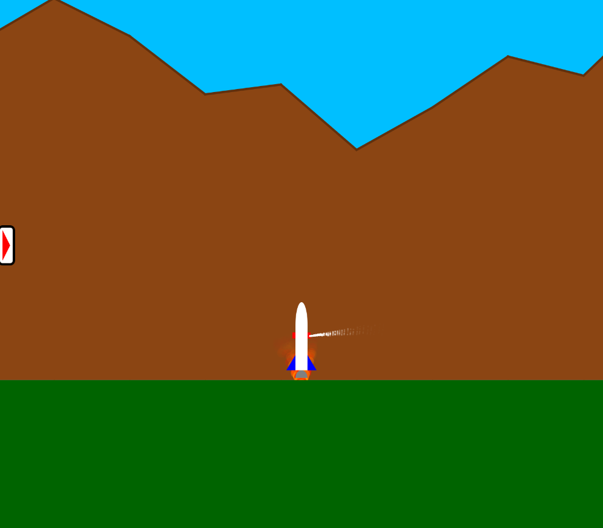

# Rocket Simulator
A rocket landing simulator, where the user can land a rocket or let the rocket land itself.

# Controls
|Key|Effect|
| ---- | ---- |
| W | Turn engine on |
| A | Rotate rocket counter-clockwise |
| S | Rotate rocket clockwise | 

# Design
The [src](src/) folder is broken into subfolders for the different parts of the simulator. 

- [rocket](src/rocket/): Code for each part of the rocket, from the particle effects to the logic self-landing rocket.
- [userinterface](src/userinterface/): Code for the [in-flight display](#in-flight-display), including a custom extensible [button class](src/userinterface/CustomButton.java)
- [world](src/world/): Code for the mountains, ground, and other parts of the world that the rocket interacts with.
- [util](src/util/): Code for objects that are useful in many areas of the simulator, like a [2D vector](src/util/Vector2D.java) container.

# Features
## Graphics and Physics
All of the graphical effects, including the rocket engine's particle effects, the rocket's shape, and the world in the background, were developed using basic shapes in the JavaFX library. Physics effects, such as velocity and acceleration due to gravity, were also personally programmed.
## Automatic Rocket Landing
The rocket can land itself even when given an unknown initial velocity and height, using some pre-programmed kinematics logic in [ManeuverCalculator.java](src/rocket/ManeuverCalculator.java). See the gif above for a demonstration.
## Interactive Rocket Landing
The user can attempt to land the rocket themselves, using the  shown above. After the rocket touches the ground, the program will show the user some information about their landing, like the speed and angle of the rocket, and whether the landing was successful or if it was a crash.
## Random Terrain Generation
The terrain is generated randomly in the [MountainManager.java](src/world/MountainManager.java) file. 
## User Interface
### Main Menu
Select Automatic to see an automatic rocket landing, or Interactive to try landing it yourself!

### Options
From the options menu, the user can set the environment's color palette.

### Color Palettes
There are 3 supported color palettes: Earth, Mars, and Night.
#### Earth

#### Mars

#### Night

### In-flight Display
During flight, a minimizable vertical display is available to the user, which shows the rocket's height, fuel left, and velocity component magnitudes, as well as a pause button.

# Execution

## Eclipse (Maven extension required)
Right-click pom.xml -> Run as -> Maven Build -> Set Goals to `clean javafx:run`

## Other environments (Maven required)
Run `mvn clean javafx:run` from the project root folder (the one containing pom.xml)
